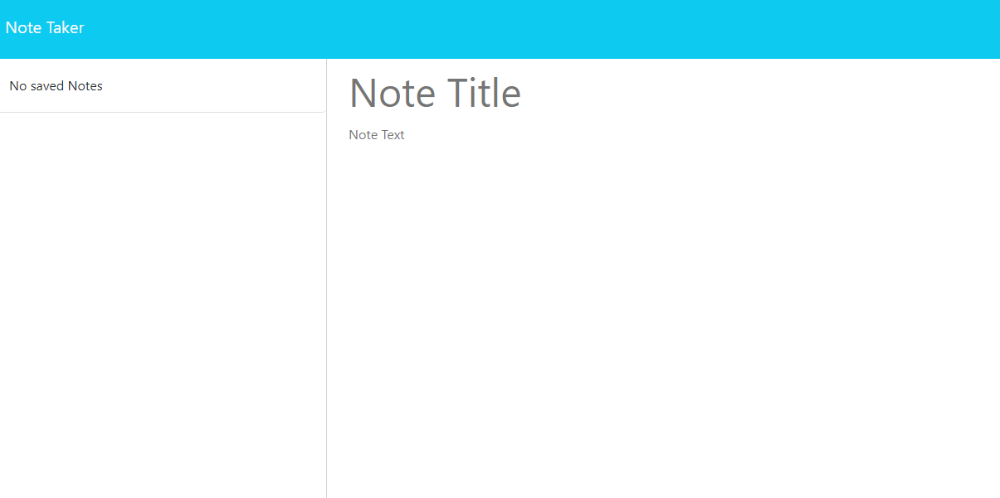

# noteTaker

## Description
This Note Taker application allows someone to enter notes and save them and then delete them as they are completed. This app can be used for professional or personal use. It uses an Express.js back end to save and retrieve note data from a JSON file. 

## Commands
Use npm install and run start 

## Links
[Deployment on Render](https://notetaker-y9tn.onrender.com)

[Note Taker Video](https://drive.google.com/file/d/1IUXzhxYs1a8dXaEFHjaT4cNUkzD_CK1Y/view)

## Github Repo 
[My Github page](https://github.com/smrsun/noteTaker)

### Visuals or Screenshots

